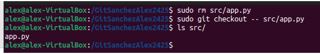

### **Actividad: Remoto y repaso de comandos anteriores**

**¿De qué trata?** 
Hay que practicar la sincronización y administración de un repositorio Git, manejar ramas, resolver diferencias (diff) e interactuar entre repositorios locales y remotos.

**IMPORTANTE**
- Quiero capturas del terminal donde se muestre el comando
- Quiero que escribas el comando en el ejercicio
- Quiero que expliques que estás haciendo
- **IMPORTANTE**: Vas a documentar todo el proyecto en un README.md dentro de la actividad. Vas a escribirlo en [Markdown](https://github.com/VelezBeatriz/ITB-M08-DAW1/blob/main/Markdown.md)
---

#### **Enunciado:**

Eres nuevo en la empresa y te han dicho que tienes que encargarte de un proyecto que recién acaba de llegar. 
Tu tarea es crear y administrar el repositorio siguiendo las instrucciones que te ha dado un compañero:

### **Parte 1: Preparación del Proyecto**
1. **Crear directorios y archivos:**  
   - Desde tu carpeta principal (`~/`), crea un directorio llamado `GitApellido1Nombre2425`.  
   - Dentro del directorio `GitApellido1Nombre2425`, crea una subcarpeta llamada `src` usando rutas relativas.
   - Crea un archivo `README.md` en `GitApellido1Nombre2425` con una breve descripción del proyecto, **usa costantemente el terminal**.

2. **Inicializa Git:**  
   - Entra en el directorio y conviértelo en un repositorio Git.
   - Agrega un archivo `.gitignore` y configúralo para ignorar [archivos de log y carpetas de configuración temporales.]

   - ¿Qué es el archivo `.gitignore` y para que sirve?
      - El archivo .gitignore es usado en Git para especificar qué archivos o carpetas no deben ser rastreados ni incluidos          en el control de versiones. Esto ayuda a evitar que archivos temporales, de configuración local o innecesarios se            suban al repositorio.
 
   - Crea una estructura básica de web `index.html`, `style.css`, `main.js`.

3. **Primera confirmación:**  
   - Haz un `git add` de todos los archivos y realiza un commit inicial con el mensaje:  
     `Inicio del proyecto con README.md y estructura básica`.

---

### **Parte 2: Colaboración en Equipo**
1. **Configura del repositorio remoto:**  
   - Entra en GitHub y crea un repositorio.
   - ¿Qué pasa si creo un repositorio con el archivo `README.md` desde GitHub?
      - QUE SE CREA EL READMI VACIO. SOLO PONE EL NOMBRE DEL REPOSITORIO 
   - ¿Qué pasa si crea un repositorio sin el archivo `README.md` desde GitHub?
      - QUE EL REPOSITORIO SE CREA TOTALMENTE VACIO 
   - Explica las diferencias entre las 2 preguntas anteriores.
      - EN LA PRIMERA TENEMOS QUE EXPLICAR QUE AL PONER UN README EL REPOSITORIO NO SE CREA VACIO, NO COMO EN LA SEGUNDA PREGUNTA   
   - Indica que comandos te da GitHub al crear un repositorio. Los encontrarás en el apartado `…or create a new repository on the command line`
      Inicializar el repositorio local:
         git init
      
      Crear un archivo README.md (opcional):
         echo "# nombre-del-repositorio" >> README.md
      
      Agregar los archivos al índice de Git:
         git add .
      
      Hacer el primer commit:
      
         git commit -m "Primer commit"
      
      Cambiar la rama principal a main (si es necesario):
         git branch -M main
      
      Vincular el repositorio local con el remoto en GitHub:
         git remote add origin https://github.com/tu-usuario/nombre-del-repositorio.git
      
      Subir los cambios al repositorio remoto:
         git push -u origin main

      Vincular el repositorio local con el remoto en GitHub:
         git remote add origin https://github.com/tu-usuario/nombre-del-repositorio.git
      
      
      Subir los cambios al repositorio remoto:
         git push -u origin main
  
     
         - Vincula el repositorio remoto con el repositorio local.
    

2. **Actualización del Proyecto:**
   - Crea una nueva rama llamada `feature/documentacion` y cámbiate a ella.
   - Cambia a la nueva rama:
     - Crea un archivo `docs.md` en la carpeta raíz. Escribe un resumen de las funcionalidades del proyecto.
     - Haz un commit con el mensaje:  
       `Agregada documentación inicial del proyecto`.
   - Cambia a la rama `main` y usa `git diff` para comparar las diferencias entre `main` y `feature/documentacion`.

3. **Sincronización:**  
   - Desde la rama `main`, realiza un `git pull` para simular la descarga de cambios del remoto. Si hay conflictos, resuélvelos.

---

### **Parte 3: Gestión de Archivos y Cambios**
1. **Ediciones rápidas:**  
   - Crea un nuevo archivo llamado `src/app.py` con un mensaje básico (`print("Hola, mundo!")`).
   - Haz un `add` y luego un `commit`. Verifica su estado con ` status` o con algún comando alias que hayas creado tú.

   - Visualiza el historial de `commit` con `log` o con algún comando alias que hayas creado tú.
   

   - Si has utilizado comandos alias, indica el equivalente al comando alias. Por ejemplo, mi comando alias `git s` es igual al comando `git status --short`.

2. **Borrado y recuperación:**  
   - Borra el archivo `src/app.py` usando un comando de terminal. Recupera el archivo con el comando necesario, lo vimos la semana pasada.
 

3. **Combina ramas:**  
   - Desde `main`, haz un merge de `feature/documentacion`.  
   - Usa `log` o un alias para verificar los cambios realizados y el historial.
 
---

### **Parte 4: Entrega del Proyecto**
1. **Últimos pasos:**  
   - Asegúrate de que todos los archivos estén en su lugar y realiza un `push` final al remoto.  
   - Realiza una limpieza eliminando la rama `feature/documentacion`.

 
2. **Explora el proyecto desde el terminal:**  
   - Usa el comando necesario de Linux para listar el contenido de cada directorio.  
   - Muestra el contenido de los archivos finales con el comando necesario de Linux.

